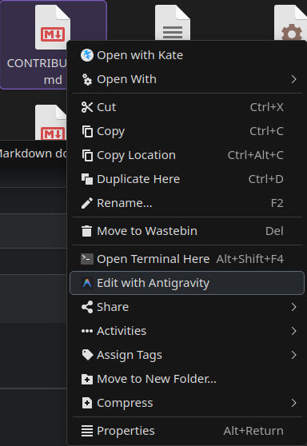
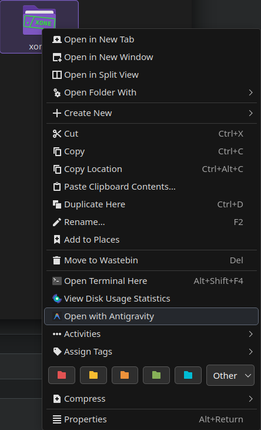

# [Edit/Open with Antigravity](https://store.kde.org/p/2348528)

Adding `Edit/Open with Antigravity` to the Dolphin context menu (depending on whether it is a file or a folder).

Based on [Edit/Open with Zed](https://github.com/Hrithik06/dolphin-service-open-with-zed) by [Hrithik06](https://github.com/Hrithik06)





## Installation

Either download through Dolphin's Context Menu Settings  
_(Burger menu → Configure → Configure Dolphin → Context Menu → Download New Services → Search for "Antigravity")_

or download the **.desktop** files manually from the [KDE Store](https://store.kde.org/p/2348528) or this GitHub repo, and put them in `~/.local/share/kio/servicemenus/` for Plasma **6**, or `~/.local/share/kservices5/ServiceMenus/` for Plasma **5**.

### Troubleshooting

**If you get "You are not authorized to execute this file" error** or **if the context menu entries don't appear**, make the files executable:

```bash
chmod +x ~/.local/share/kio/servicemenus/open-directory-with-antigravity.desktop
chmod +x ~/.local/share/kio/servicemenus/open-file-with-antigravity.desktop
```

## Credits

Inspired by Hrithik06's [Edit/Open with Zed](https://github.com/Hrithik06/dolphin-service-open-with-zed)
